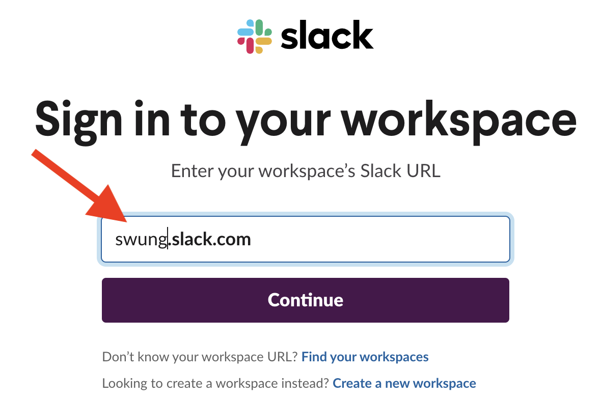

# Software Underground's JupyterHub deployment

This repository contains Terraform files to deploy
a JupyterHub on Kubernetes using the official JupyterHub
[Helm chart](https://jupyterhub.github.io/helm-chart/).

This JupyterHub uses the Helm chart version `0.11.1`.

We are standing on the shoulders of giants such as:

* Quansight's [Qhub](https://github.com/Quansight/qhub-cloud) Terraform-based deployment
* [Zero to JupyterHub with Kubernetes](https://zero-to-jupyterhub.readthedocs.io)

## Login process

* Go to [https://jupyter-dev.softwareunderground.org/](https://jupyter-dev.softwareunderground.org/)
and click on `Sign in with Slack`:

* Fill out the Workspace's URL: `swung.slack.com`:

* Sign in into Slack:

* Allow the SwungHub Slack app to access your credentials:

* Enjoy!

## Roadmap

TBD

## Tools

* [Amazon EC2 Instance Selector](https://github.com/aws/amazon-ec2-instance-selector)

## How it works

* Infrastructure (IaaC)
* JupyterHub

## Deployment process

1. Deploy the Kubernetes cluster: execute `terraform apply` inside the `infrastructure` directory.
2. Update the `CNAME` of the JupyterHub endpoint with the new value shown after completion of the Terraform deployment.
3. Deploy the JupyterHub: execute `terraform apply` inside the `jupyterhub` directory.

## Questions

* [Discussion](https://github.com/softwareunderground/jupyterhub-deployment/discussions)
* [#swung-cloud](https://swung.slack.com/archives/C013Z9UQXGX) Slack channel

## How to contribute

TBD

## Code of Conduct

TBD

## License

[Apache License 2.0](https://github.com/softwareunderground/jupyterhub-deployment/blob/main/LICENSE)
